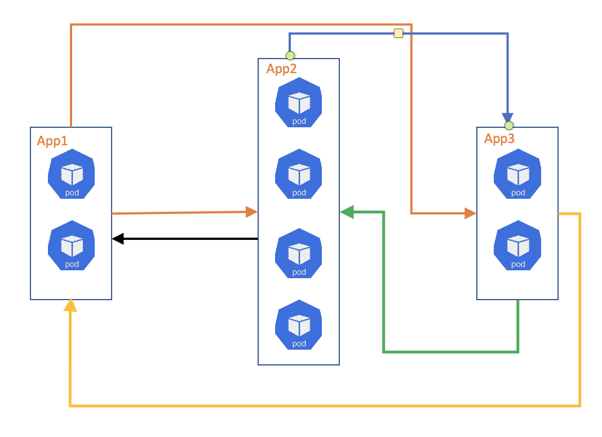

# Micorservices Communication App (MiCo)

A generic tool to create an arbitrary microservices topology to explore the communication between various services in a distributed application.

## Overview

The tool is based on a simple Python Flask based webapp. The app contains a copy of the `config.yaml` file and accepts requests of the form `/svc/<int:index>`. The index value is matched against the config file and parallel requests are made to the URLs, which are K8s services, defined in the `svc` value associated with the `index`.

The `cost` value refers to the response time of the current function alone and does not include response times of any fanout requests. Currently, it is implemented through `sleep`.

A failure of any of the fanout requests returns a failure response for the parent. As such, failures at any level of the topology rises upwards thought the architecture.

## Configuration Elements

```yaml
- index: <int>
  svc: 
    - <K8s_service_name:port>
    - <K8s_service_name:port>
  replicas: <int>
  cost: <int>
```

## Defining a Topology

Each configuration element corresponds to a service. The `index` provides an ID to the service and requests to the corresponding URL are forwarded to pods in this service.

The URLs in the associated `svc` value are to make fanout requests. An empty list for the `svc` field indicates a leaf service in the topology.

The `replicas` field determine how many replicas of the service are to be run.

The `cost` value indicates how long a service waits before responding or making fanout requests.

## Running MiCo

### Prequisites

A running Kubernetes cluster.

### Create and Deploy MiCo

Define the topology in [`app/config.yaml`](app/config.yaml). Refer to [configuration elements](#Configuration-Elements).

```bash
chmod +x create_yaml.py app/docker_build.sh deploy_topo.sh
cd app && ./docker_build.sh <image_name> && cd - # build the container image
./create_yaml.py <image_name> # create the K8s service and deployement config files
./deploy_topo.sh # deploy the entire topology
```

## Flow of Requests



In the example configuration provided, [`app/config.yaml`](app/config.yaml), there are three elements, identified by the following indices:

- `index 0`: this has 2 replicas, a cost of 20 and makes two parallel requests to `App2` and `App3`.
- `index 1`: this has 4 replicas, a cost of 2 and makes a single request to `App3`
- `index 2`: this has 2 replicas and a cost of 4.

This means that upon receiving a request, `App1` makes two new requests to `App2` and `App3` - the two ***orange*** arrows in the figure. `App2` makes a request to `App3` -  the blue one. `App3` doesn't make any further requests and replies to the requests made by `App1` and `App2` - the ***green*** and ***yellow*** ones.

Once `App2` receives the ***green*** response, it responds back to `App1` - the ***black*** one.

Note: MiCo makes no timing guaranteess, i.e. the ***yellow*** reponse from `App3` might reach `App1` before the ***green*** response reaches `App2`, for example. However, the request is not complete and any app in the tool will not send a response till all fanout responses are received. For example, in this scenario `App1` will respond to the client only when both ***yellow*** and ***black*** responses are received.

## Workhorse of the tool

The workhorse of the tool is a function that finds the largest prime number lesser than a given number by checking each number smaller than the argument.

The `cost` of the function is implemented by running this prime finding function `cost` times with a for loop.

## Note

It is advisable to define the name of the image as an environment variable:

```bash
export IMG_NAME=<image_name>
```

## Testing

```bash
export PORT_NUM=$(kubectl get svc testapp-svc-0 -o go-template='{{range.spec.ports}}{{if .nodePort}}{{.nodePort}}{{"\n"}}{{end}}{{end}}')
```

### Hey

```bash
wget https://hey-release.s3.us-east-2.amazonaws.com/hey_linux_amd64
chmod +x hey_linux_amd64
sudo mv hey_linux_amd64 /usr/local/bin/hey
hey -z 5m -disable-keepalive http://localhost:$(PORT_NUM)/svc/0
```

### Apache Benchmark

```bash
sudo apt install apache2-utils
ab -n 500 -c 10 -s 9999 http://localhost:$(PORT_NUM)/svc/0
```
